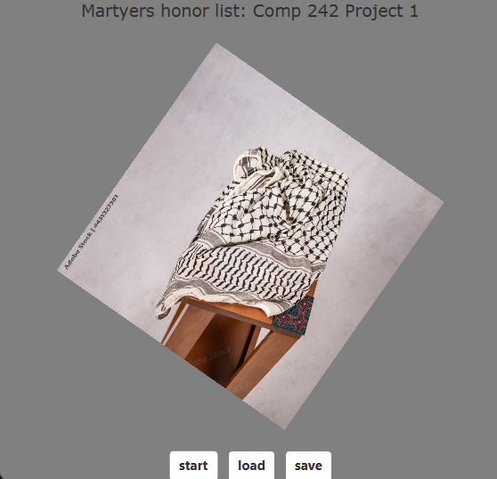
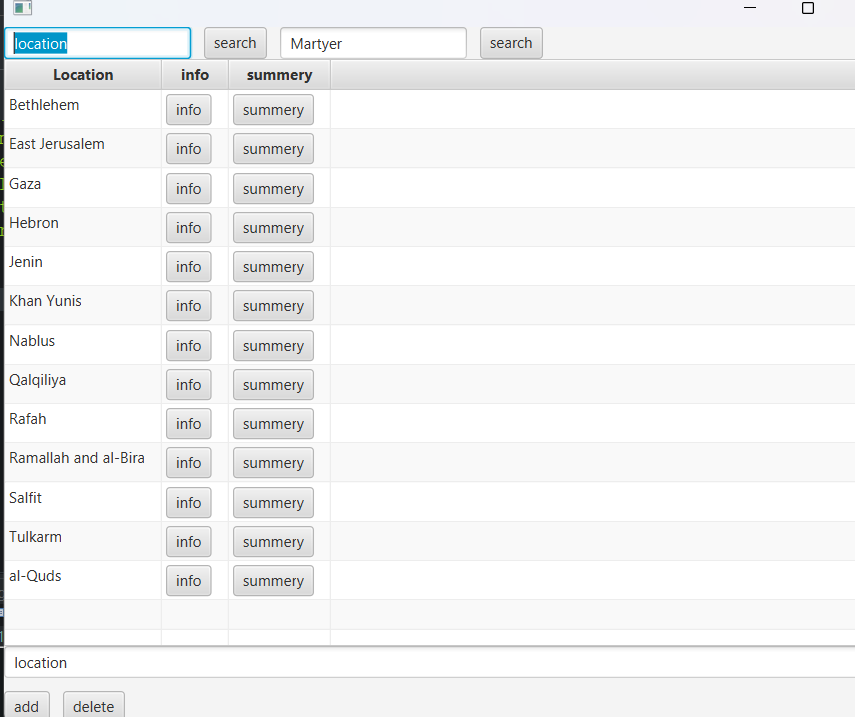
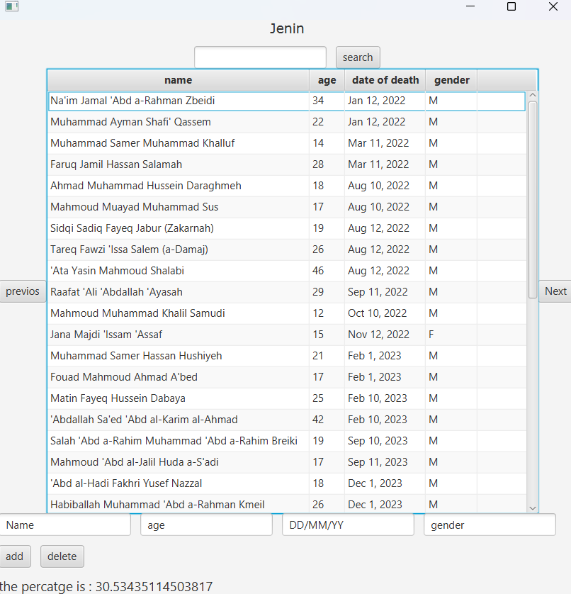
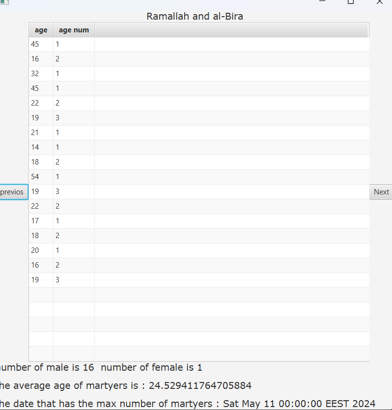

# 🏛 Martyrs Management System



A **JavaFX application** to manage locations and martyrs. Users can add, edit, delete, search martyrs, and view summaries per location.

---

## 📂 Project Structure

```

StructPhase1/
├─ src/
│  └─ structPhase1/
│     ├─ CitiesTableView.java
│     ├─ Location.java
│     ├─ MartyesInfo.java
│     ├─ SummeryScreen.java
│     ├─ Martyer.java
│     ├─ LinkedList.java
│     ├─ Node.java
│     └─ other utility classes
├─ images/
│  ├─ locations_table.png
│  ├─ martyes_info.png
│  └─ summary_screen.png
├─ README.md
└─ .gitignore

````

---

## ⚡ Features

- Add, edit, delete martyrs per location
- Search martyrs by name
- Navigate between locations
- View summary statistics:
  - Gender count
  - Average age
  - Date with most martyrs
- Sort martyrs by date of death

---

## 🖼 Screenshots

**Capture these screens:**

1. **Main Locations Table** – list of locations, add/delete/search buttons  
   

2. **Martyes Info Table** – martyrs of a location, editable table with add/delete buttons  
   

3. **Summary Screen** – statistics (gender count, average age, max death date) and age frequency table  
   

---

## 🛠 How to Run

1. Clone the repository:

```bash
git clone https://github.com/YourUsername/StructPhase1.git
````

2. Open the project in **IntelliJ IDEA** or **Eclipse** with **JavaFX support**
3. Run the `CitiesTableView` main class
4. Ensure JavaFX SDK is properly linked

---

## 📚 Data Structures

* **DoubleLinkedList<Location>** – stores locations, supports add, search, navigation
* **LinkedList<Martyer>** – stores martyrs per location
* **Node / DoubleNode** – linked list nodes

---

## 📌 Usage

* Add a new location or martyr using text fields and buttons
* Edit martyrs directly in table cells
* Use search bar to filter martyrs by name
* Navigate through locations using `Next` / `Previous` buttons
* Open **Summary Screen** for location statistics

---

## 📝 Notes

* Sorting is based on `Location` name and `Martyer` date of death
* Tables update automatically after add/edit/delete operations
* Percentages, averages, and counts are calculated per location

```

---

